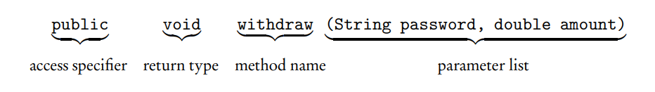

### [Return to table of content](../../readme.md)

# Classes and Objects

## Objects

Every program that you write involves at least one thing that is being created or manipulated by the program. This thing, together with the operations that manipulate it, is called an object.

Consider, for example, a program that must test the validity of a four-digit code number that a person will enter to be able to use a photocopy machine. Rules for validity are provided. The object is a four-digit code number. Some of the operations to manipulate the object could be `readNumber, getSeparateDigits, testValidity, and writeNumber`.

Any given program can have several different types of objects. For example, a program that maintains a database of all books in a library has at least two objects:

1. A Book object, with operations like `getTitle, isOnShelf,isFiction, and goOutOfPrint`.
2. A ListOfBooks object, with operations like `search, addBook, removeBook, and sortByAuthor`.
An object is characterized by its state and behavior. For example, a book has a state described by its title, author, whether it’s on the shelf, and so on. It also has behavior, like going out of print.

Notice that an object is an idea, separate from the concrete details of a programming language. It corresponds to some real-world object that is being represented by the program.

All object-oriented programming languages have a way to represent an object as a variable in a program. In Java, a variable that represents an object is called an object reference.

## Classes
A class is a software blueprint for implementing objects of a given type. An object is a single instance of the class. In a program there will often be several different instances of a given class type.

The current state of a given object is maintained in its data fields orinstance variables, provided by the class. The methods of the class provide both the behaviors exhibited by the object and the operations that manipulate the object. Combining an object’s data and methods into a single unit called a class is known as encapsulation.

* Here is the framework for a simple bank account class:

```java

public class BankAccount
{
private String password;
private double balance;
public static final double OVERDRAWN_PENALTY = 20.00;
//constructors
/** Default constructor.
* Constructs bank account with default values. */
  public BankAccount() { /* implementation code */ }
  /** Constructs bank account with specified password and balance. */
  public BankAccount(String acctPassword, double acctBalance) { /* implementation code */ }
  //accessor
  /** @return balance of this account */
  public double getBalance() { /* implementation code */ }
  //mutators
  /** Deposits amount in bank account with given password.
* @param acctPassword the password of this bank account
* @param amount the amount to be deposited
  */
  public void deposit(String acctPassword, double amount) { /* implementation code */ }
  /** Withdraws amount from bank account with given password.
* Assesses penalty if balance is less than amount.
* @param acctPassword the password of this bank account
* @param amount the amount to be withdrawn
  */
  public void withdraw(String acctPassword, double amount) { /* implementation code */ }
  }
```


### Public, private and static
The keyword `public` preceding the class declaration signals that the class is usable by all client programs. If a class is not public, it can be used only by classes in its own package. In the AP Java subset, all classes are public.

Similarly, public methods are accessible to all client programs. Clients, however, are not privy to the class implementation and may not access the private instance variables and private methods of the class. Restriction of access is known as information hiding. In Java, this is implemented by using the keyword `private`. `Private methods` and variables in a class can be accessed only by methods of that class. Even though Java allows public instance variables, in the AP Java subset all instance variables are private.

A `static variable` (class variable) contains a value that is shared by all instances of the class. “Static” means that memory allocation happens once.

Typical uses of a static variable are to

* keep track of statistics for objects of the class.
* accumulate a total.
* provide a new identity number for each new object of the class
For example:
```java
public class Employee {
private String name;
private static int employeeCount = 0; //number of employees
public Employee( < parameter list > ) {
< initialization of private instance variables >
employeeCount++; //increment count of all employees
}
...
}
```


Notice that the static variable was initialized outside the constructor and that its value can be changed.

Static final variables (constants) in a class cannot be changed. They are often declared public. The variable `OVERDRAWN_PENALTY` is an example in the BankAccount class. Since the variable is public, it can be used in any client method. The keyword static indicates that there is a single value of the variable that applies to the whole class, rather than a new instance for each object of the class. A client method would refer to the variable as `BankAccount.OVERDRAWN_PENALTY`. 

In its own class it is referred to as simply OVERDRAWN_PENALTY.

# Methods

## Headers

All method headers, with the exception of constructors and static methods, look like this:



* The access specifier tells which other methods can call this method (public, private and static in the previous page).
* A return type of void signals that the method does not return a value. All other return types are typical data types and method returns the same data type.
* Items in the parameter list are separated by commas.
* The implementation of the method directly follows the header, enclosed in a {} block.

Here is an example from the previous BankAccount class:

```java
public double getBalance() {
  return this.balance;
}
// this method returns a balance of type double and it has a public access specifier
```

## Type of methods

### Constructors

A constructor creates an object of the class. You can recognize a constructor by its name—always the same as the class. Also, a constructor has no return type.

Having several constructors provides different ways of initializing class objects. For example, there are two constructors in the BankAccount class.

1. The default constructor has no arguments. It provides reasonable initial values for an object. Here is its implementation:

```java
// Constructs a bank account with default values
public BankAccount() {
  password = "";
  balance = 0.0;
}
```

In a client method, the declaration:

```java
BankAccount bankAcc = new BankAccount();

```
constructs a BankAccount object with a balance of zero and a password equal to the empty string. The new operator returns the address of this newly constructed object. The variable bankAcc is assigned the value of this address—we say “bankAcc is a reference to the object.” Picture the setup like this:

2. The constructor with parameters sets the instance variables of a BankAccount object to the values of those parameters.
Here is the iplementation:

```java
// Constructs a bank account with specified password and balance
public BankAccount(String acctPassword, double acctBalance) {
  password = acctPassword;
  balance = acctBalance;
}
```

In a client program a declaration that uses this constructor needs matching parameters:

`BankAccount bankAcc2 = new BankAccount("Nazym", 800.00);
`
`bankAcc` and `bankAcc2` are object variables that store the addresses of their respective BankAccount objects. They do not store the objects themselves.

### Accessors

An accessor method accesses a class object without altering the object. An accessor returns some information about the object.

The BankAccount class has a single accessor method, getBalance(). Here is its implementation:

```java
// return the balance of this account
public double getBalance() {
  return balance;
}
```
A client program may use this method as follows:
```java
BankAccount b1 = new BankAccount("MattW", 500.00);
BankAccount b2 = new BankAccount("DannyB", 650.50);
System.out.println(b1.getBalance()); // prints a balance of b1
if (b1.getBalance() > b2.getBalance()) { // comparison of b1 and b2 balances
 ...
}
```
The `. operator` (dot operator) indicates that `getBalance()` is a method of the class to which `b1` and `b2` belong, namely the BankAccount class.

### Mutators

A mutator method changes the state of an object by modifying at least one of its instance variables.

Here are the implementations of the deposit and withdraw methods, each of which alters the value of balance in the BankAccount class:
```java
// Deposits amount in a bank account with the given password
public void deposit(String acctPassword, double amount) {
  if (!acctPassword.equals(password))
    /* throw an exception */
  else
    balance += amount;
}

// Withdraws amount from bank account with given password.
// Assesses penalty if balance is less than amount.
public void withdraw(String acctPassword, double amount) {
  if (!acctPassword.equals(password))
    /* throw an exception */
  else {
    balance -= amount; //allows negative balance
    if (balance < 0)
      balance -= OVERDRAWN_PENALTY;
  }
}
```

A mutator method in a client program is invoked in the same way as an accessor: using an object variable with the dot operator. For example, assuming valid BankAccount declarations for `b1` and `b2`:

```java
b1.withdraw("MattW", 200.00);
b2.deposit("DannyB", 35.68);
```

### Static methods

#### Static method vs Instance Method

The methods discussed in the preceding sections—constructors, accessors, and mutators—all operate on individual objects of a class. They are called instance methods. A method that performs an operation for the entire class, not its individual objects, is called a static method (sometimes called a class method).

The implementation of a static method uses the keyword static in its header. There is no implied object in the code (as there is in an instance method). Thus, if the code tries to call an instance method or invoke a private instance variable for this nonexistent object, a syntax error will occur. A static method can, however, use a static variable in its code. For example, in the Employee example, you could add a static method that returns the employeeCount:

```java
public static int getEmployeeCount() {
  return employeeCount;
}
```
### Method overloading

Overloaded methods are two or more methods in the same class that have the same name but different parameter lists. For example:

```java
public class ProductOperations {
  public int product(int n) { return n * n; }
  public double product(double x) { return x * x; }
  public double product(int x, int y) { return x * y; }
  ...
}
```
The compiler figures out which method to call by examining the method’s signature. The signature of a method consists of the method’s name and a list of the parameter types. Thus, the signatures of the overloaded `product` methods are

```java
product(int)
product(double)
product(int, int)
```
Note that for overloading purposes, the return type of the method is irrelevant. You can’t have two methods with identical signatures but different return types. The compiler will complain that the method call is ambiguous.

Having more than one constructor in the same class is an example of overloading. Overloaded constructors provide a choice of ways to initialize objects of the class.

#### Scope

The scope of a variable or method is the region in which that variable or method is visible and can be accessed.

The instance variables, static variables, and methods of a class belong to that class’s scope, which extends from the opening brace to the closing brace of the class definition. Within the class all instance variables and methods are accessible and can be referred to simply by name (no dot operator!).

A local variable is defined inside a method. It can even be defined inside a statement. Its scope extends from the point where it is declared to the end of the block in which its declaration occurs. A block is a piece of code enclosed in a {} pair. When a block is exited, the memory for a local variable is automatically recycled.

Local variables take precedence over instance variables with the same name. (Using the same name, however, creates ambiguity for the programmer, leading to errors. You should avoid the practice.)

#### The this Keyword

An instance method is always called for a particular object. This object is an implicit parameter for the method and is referred to with the keyword this. In the implementation of instance methods, all instance variables can be written with the prefix this followed by the dot operator.

* Here are examples of this usage

```java
// Consider a rational number class called Rational, which has 
// two private instance variables

private int num; //numerator
private int denom; //denominator

// constructor
public Rational(int num, int denom) {
  this.num = num;
  this.denom = denom;
}
```

It is definitely not a good idea to use the same name for the explicit parameters and the private instance variables. But if you do, you can avoid errors by referring to `this.num` and `this.denom` for the current object that is being constructed.

## Refernces

### Reference vs Primitive data types

All of the numerical data types, like `double` and `int`, as well as types `char` and `boolean`, are primitive data types. All objects are reference data types. The difference lies in the way they are stored. Consider the statements

```java
int num1 = 3;
int num2 = num1;
```
The variables `num1` and `num2` can be thought of as memory slots, labeled `num1` and `num2`, respectively:


If either of the above variables is now changed, the other is not affected. Each has its own memory slot.

Contrast this with the declaration of a reference data type. Recall that an object is created using new:

`Date d = new Date(2, 17, 1948);`

This declaration creates a reference variable d that refers to a Date object. The value of d is the address in memory of that object:


Suppose the following declaration is now made:

```java
Date birthday = d;
```
This statement creates the reference variable birthday, which contains the same address as `d`:

Having two references for the same object is known as `aliasing`. Aliasing can cause unintended problems for the programmer. The statement `d.changeDate();` will automatically change the object referred to by `birthday` as well.

What the programmer probably intended was to create a second object called birthday whose attributes exactly matched those of d. This cannot be accomplished without using new. For example,

`Date birthday = new Date(d.getMonth(), d.getDay(), d.getYear());`

The statement d.changeDate() will now leave the birthday object unchanged.

#### The null reference

The declaration

`BankAccount b;`

defines a reference b that is uninitialized. (To construct the object that b refers to requires the new operator and a BankAccount constructor.) An uninitialized object variable is called a null reference or null pointer. You can test whether a variable refers to an object or is uninitialized by using the keyword null:

```java
if (b == null) {
...
}
```

If a reference is not null, it can be set to null with the statement `b = null`;

An attempt to invoke an instance method with a null reference may cause your program to terminate with a `NullPointerException`. For example,

```java
BankAccount b; // declared a BankAccount object b

b.withdraw(acctPassword, amt); // throws a NullPointerException
                               // b is not initialized yet
```
Any method call for an object of the class that tries to access the null reference will cause a run-time error: The program will terminate with a `NullPointerException`.


