### [Return to table of content](../../readme.md)
# Intro to Java Lang Features

The Java programming language is a high-level language that can be characterized by all of the following buzzwords:
* Simple
* Object oriented
* Distributed
* Multithreaded
* Dynamic
* Architecture neutral
* Portable
* High performance
* Robust
* Secure

Java language was developed by James Gosling and Henry McGilton.

In the Java programming language, all source code is first written in plain text files ending with the .java extension. Those source files are then compiled into .class files by the javac compiler. A .class file does not contain code that is native to your processor; it instead contains bytecodes — the machine language of the Java Virtual Machine1 (Java VM). The java launcher tool then runs your application with an instance of the Java Virtual Machine.


Java has a philosophy of WORE (Wright Once Run Anywhere), due to that, java became insanely widespread around the globe. More than 4 billion devices right now are working on jvm.


Let's start the main part of our lesson.

1.[ Packages and Classes]()
2. Types and Identifiers
3. Operators
4. Input/Output
5. Control structures
6. Errors and exceptions


## Packages and Classes

 In java classes are organised in _packages_  

 What does it mean? It means that fundamental unit of every java program _class_ is grouped in _packages_.
 Let's see some examples:
    [Link to package example](/Users/admin/IdeaProjects/open-java/src/main/java/org/example/day1/DemoPackage.java)

```java
package org.example.day1;

public class Main {
    public static void main(String[] args) {
        System.out.println("Hello World");
    }
}
```
**Note good to know:**
1. All Java methods must be contained in a class.
2. The words _class_, _public_, _static_, and _void_ are reserved words, also called [_keywords_](https://en.wikipedia.org/wiki/List_of_Java_keywords). (This means they have specific uses in Java and may not be used as identifiers.)
3. The keyword public signals that the class or method is usable outside of the class, whereas private data members or methods (see Chapter 3) are not.
4. The keyword static is used for methods that will not access any objects of a class, such as the methods in the FirstProg class in the example above. This is typically true for all methods in a source file that contains no instance variables (see Chapter 3). Most methods in Java do operate on objects and are not static. The main method, however, must always be static.
5. The program shown above is a Java application.
6. There are three different types of comment delimiters in Java:

   * /* … */, which is the one used in the program shown, to enclose a block of comments. The block can extend over one or more lines.
   * //, which generates a comment on one line.
   * /** … */, which generates Javadoc comments. These are used to create API documentation of Java library software.
 

## Types and Identifiers
*  ### Identifiers

An **identifier** is a name for a variable, parameter, constant, user-defined method, or userdefined class. In Java, an identifier is any sequence of letters, digits, and the underscore character.
The naming convention for the identifier is usually **_CamelCase_**.
    
examples of CamelCase. _getName, findSurfaceArea, preTaxTotal_ 

The naming of classes starts with capital letter such as _class Main, class String_.


* Identifiers may not begin with a digit.
```java
int variable1; // allowed
int _variable; // allowed
int 1variable; // not allowed
```


Identifiers are case-sensitive, which means that number and Number are different. number ≠ Number.
```java
int number;
int Number; // this variable is different from the previous
```

* Wherever possible, identifiers should be concise and self-documenting. A variable called area is more illuminating than one called a.
```java
int area; // good example
int perimeter; // good example
int a; // bad example
```

### **Naming convention**
It is important to format code properly in Java. For this purpose, lowerCamelCase is used for variables and methods and UpperCamelCase for class names. It means that identifiers for variables and methods are lowercase.Uppercase letters are used to separate these into multiple words, for example, getAge, myVariable. However, a class name starts with a capital letter.
```java
//UpperCamelCase
Class MyExampleClass {
...
}

// lowerCamelCase
public void myExampleMethod (int number) {
...
}

int myExampleVariable; // lowerCamelCase
```

### Data types
Every identifier in a Java program has a type associated with it. These data types are divided into two types - primitives and reference. Now, we will cover primitive data types and discuss reference types later.

* Java includes 8 primitive data types:
    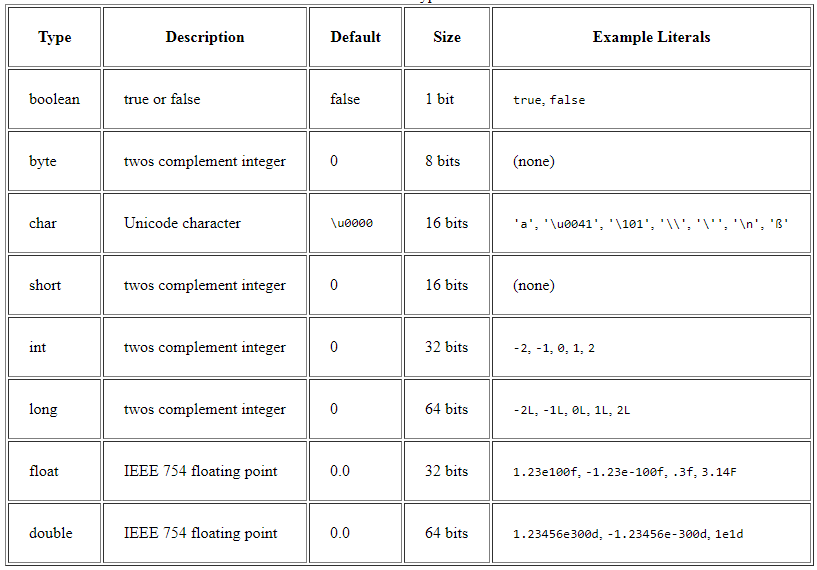
### **Why do we need so many integer types?**
It is important to take into account memory usage during optimization of our program. The less memory our program uses, the faster it works.

The main difference between byte, short, int, long is their size. When we declare a variable, memory is automatically allocated for it depending on its type. It is important to declare a correct type of variable if you know exactly how big the number will be and how often it will change so that you can save as much memory as possible or, conversely, allocate enough memory in advance. If you try to store a value whose magnitude is too big in an int variable, you'll get an overflow error. (Java gives you no warning. You just get a wrong result!)

Table with sizes of numerical data types:
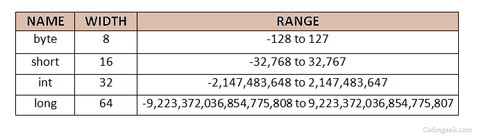

Here are examples of declaration and initialization of each primitive type:
boolean myBoolean = true; // true

```java
byte myByte = 1; // 1
byte myByte = 1000; // Error

char myChar = 'a'; // a

short myShort = 11; // 11
short myShort = 40000 // Error

int myint = 100; // 100

long myLong = 1000; // 1000

float myFloat = 11.5; // 11.5

double myDouble = 101.2;
double myDouble = 20 / 7; // 2.0 (integer division)
double myDouble = 20.0 / 7.0; // 2.857142857142857
```
### **Type Casting**

In java **type casting** is a method that coverts data from one type to another data type. It works both manually and automatically.  The automatic conversion is done by the compiler and manual conversion performed by the programmer.

* Widening Casting (automatically) - converting a smaller type to a larger type size

`byte -> short -> char -> int -> long -> float -> double`


```java
public class Main {
  public static void main(String[] args) {
    int myInt = 9;
    double myDouble = myInt; // Automatic casting: int to double

    System.out.println(myInt);      // Outputs 9
    System.out.println(myDouble);   // Outputs 9.0
  }
}
```
* Narrowing Casting (manually) - converting a larger type to a smaller size type

`double -> float -> long -> int -> char -> short -> byte`
```java
public class Main {
  public static void main(String[] args) {
    double myDouble = 9.78d;
    int myInt = (int) myDouble; // Manual casting: double to int

    System.out.println(myDouble);   // Outputs 9.78
    System.out.println(myInt);      // Outputs 9
  }
}
```
! IF you try to downcast a type, an _overflow error_.

**Variables**

* Variables in Java can be initialized in two different ways:

``` java
int myVariable;
myVariable = 2; // default initialization

int num = 4; // initalization in the declaration
```
* One type can be cast to another type if appropriate

```java
int total = 3, n = 2;
double average;

average = (double) total/n;
// or
average = total/(double) n;
```

Assigning int to a double automatically casts the int to double.

```java
int num = 3;
int double doubleNum = num; // num is cast to double
```

* However, assigning a double to int causes a compile-time error.
```java
double num = 3.7;
int intNum = num; // Error

int intNum = (int) num; // Will round num to 3
```

* As you may have noticed, casting a floating point number to an integer simply truncates the number. If you want to round your number to the nearest integer, you need to write:

```java
double num = 3.7;
int roundedNum = (int) (num + 0.5); // roundedNum = 4

ouble negNum = -4.8;
int roundedNegNum = (int) (negNum - 4.8); // roundedNegNum = -5
```


### Final variables
A final variable or user-defined constant, identified by the keyword final, is a quantity whose value will not change. By conventions, final variables are capitalized and use '_' symbol to distinguish between words.

* Some examples of final declarations:

```java
final int YEAR_OF_BIRTH = 2003;
final double MY_WEIGHT = 62.320;

```
* A final variable can declared without initializing it immediately

```java
int age = 21;
final boolean IS_ADULT;

if (age >= 18)
IS_ADULT = true;
else
IS_ADULT = false;
```

## Operators
### Arithmetic operations
There are 5 arithmetic operations

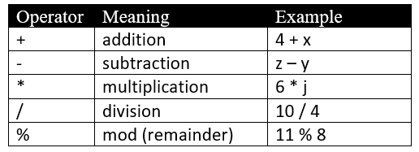
Example of usage of arithmetic operations:

```java

int a = 3 + 4; // 7

int a = 10 - 6; // 4

int a = 6 * 2; // 12

int a = 6 / 2; // 3

int a = 10 % 3 // 1
```

These operators can be applied to types int and double, even if both types occur in the same expression. For an operation involving a double and an int, the int is promoted to double, and the result is a double.

The mod operator %, as in the expression a % b, gives the remainder when a is divided by b. Thus 10 % 3 evaluates to 1, whereas 4.2 % 2.0 evaluates to 0.2.

Integer division a/b where both a and b are of type int returns the integer quotient only (ie., the answer is truncated). Thus, 22/6 gives 3, and 3/4 gives 0. If at least one of the operands is of type double, then the operation becomes regular floating-point division, and there is no truncation. You can control the kind of division that is carried out by explicitly casting (one or both of) the operands from int to double and vice versa. Thus

```java
double a = 3.0 / 4; // 0.75

double a = 3 / 4.0; // 0.75

double a = (int) 3.0 / 4; // 0.0

double a = (double) 3 / 4; // 0.75

double a = (double) (3 / 4); // 0.0
```

### Precedence rules

Arithmetic operators follow the normal precedence rules (order of operations):

1. parentheses, from the inner ones out (highest precedence)
2. *, /, %
3. +, -

* Here operators on the same line have the same precedence, and, in the absence of parentheses, are invoked from left to right.

`19 % 5 * 3 + 14 -> 4 * 3 + 14 -> 12 + 14 -> 26`
### Relational Operators
There are 6 relational operations

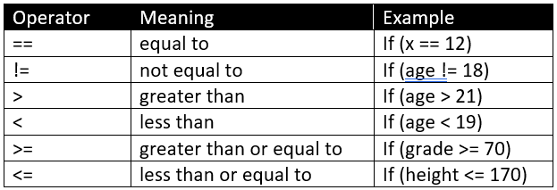

Relational operations are used in boolean expressions that evaluate to true or false:
```java
boolean x = (3 * 2) == 6; // true

boolean x = a != b; // initializes x to true if a and b are not equal, false otherwise

return a >= b; // returns true if a is greater than or equal to b, false otherwise

if (a < 5) { // enters code block if a is less than 5 ...
}
```

Relational operators should generally be used only in the comparison of primitive types (i.e., int, double, or boolean). Strings are compared using the equals and compareTo methods (will be discussed later).

### Logical operations
A logical operator (sometimes called a boolean operator) is one that returns a boolean result that is based on the boorean results of one or two other boolean expressions. There are only three logical operations.
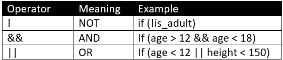


Logical operators are applied to boolean expressions to form compound boolean expressions that evaluate to true or false.
```java
int a = 5, b = 3, c = 1;

boolean check = !(a > b); // false

check = a > b && b > c; // true

if (a == b || b == c) { // will enter a block of code if a equals b OR b equals c
...
}
```

Values of true or false are assigned according to the truth tables for the logical operators

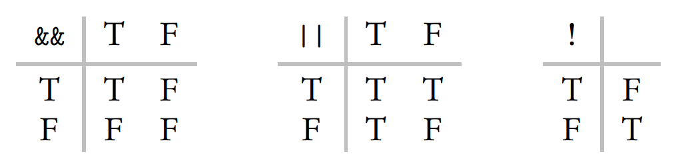
```java
boolean check;

check = false && true; // false

check = false || true; // true

check = !false; // true
```
### Assignment operators
* There are 6 assignment operators
* 
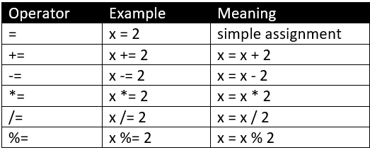


All these operators, with the exception of simple assignment, are called compound assignment operators. The int num;

num = 3; // 3

num += 10; // 13

num -= 5; // 8

num *= 3; // 24

num /= 4; // 6 operator is the combination of more than one operator. It includes an assignment operator and arithmetic operator or bitwise operator. The specified operation is performed between the right operand and the left operand and the resultant assigned to the left operand. Generally, these operators are used to assign results in shorter syntax forms. In short, the compound assignment operator can be used in place of an assignment operator.
```java
int num;

num = 3; // 3

num += 10; // 13

num -= 5; // 8

num *= 3; // 24

num /= 4; // 6

```
* Chaining of assignment statements is allowed, with evaluation from right to left.

```java
int first, second, third;
third = second = first = 12; // initalizes first to 12, then second to 12 then third to 12

```
Increment and decrement operators
It is often needed to increment or decrement variables in our programs. There are special operators to perform these operations with a shorter syntax.

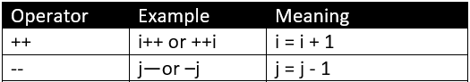

Note that i++ (postfix) and ++i (prefix) both have the net effect of incrementing i by 1, but they are not equivalent. For example, if i currently has the value 5, then System.out.println(i++) will print 5 and then increment i to 6, whereas System.out.println(++i) will first increment i to 6 and then print 6. It’s easy to remember: if the ++ is first, you first increment. A similar distinction occurs between j-- and --j.
```java
int i = 5;

System.out.println(i++) // 5 is printed, and i = 6

System.out.println(++i) // 7 is printed, and i = 7

```


## Input/Output

### Input
User input is often required in our programs. In Java, class **Scanner** is used to get user input and this class is found in `java.util` package.

* To use **Scanner** class, we need to create an object of this class. Then, we can use any available methods found in class **Scanner**. Let's see an example with the nextLine() method:

```java
Scanner myScanner = new Scanner(System.in); // creating a Scanner object which reads user input
System.out.println("Enter your name:"); // asking user for an input, it is optional
String name = myScanner.nextLine(); // Reading user input and assigning it to a variable

```

If I input "Sanzhar" to this program, then the value of the variable "name" will be "Sanzhar".

* `nextLine()` is not the only method of Scanner class:

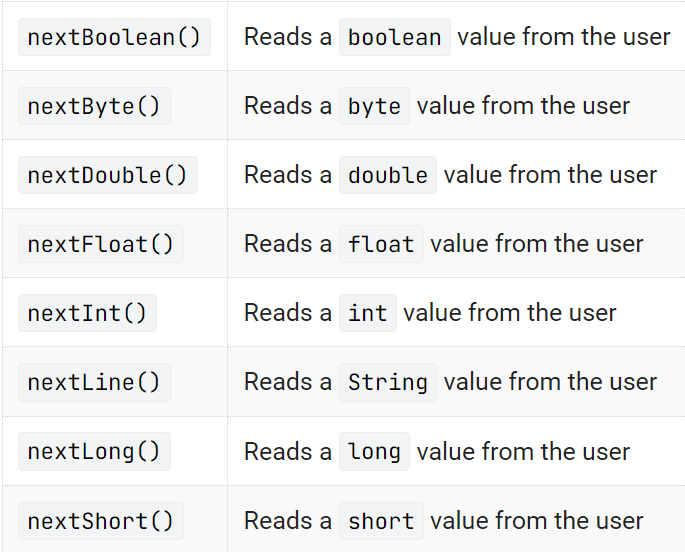

* Let's see some more examples using these methods:

```java
Scanner myScanner = new Scanner(System.in); // creating a Scanner object which reads user input

System.out.println("Enter your age:");

byte age = myScanner.nextByte();

System.out.println("Enter your salary:");

int salary = myScanner.nextInt();

System.out.println("Enter your height:");

double height = myScanner.nextDouble();

```

Scanner class has distinct methods for all imperative data types and String class and we need to use corresponding method for each data type. Also, user's input should match a data type you expect. Otherwise, program will terminate with an error. **Scanner** class can also be used for a file input, but we will not cover it in this intensive.

### Output
System.out is an object in the System class that allows output to be displayed on the screen. The println method outputs an item and then goes to a new line. The print method outputs an item without going to a new line afterward. An item to be printed can be a string, or a number, or the value of a boolean expression (true or false). Here are some examples:

```java
System.out.print("Jusan");
System.our.print("Singularity");
// prints JusanSingularity

System.out.println("Jusan");
System.our.println("Singularity");
// prints Jusan
//        Singularity

System.out.println(7 + 3); // prints 10

System.out.println(7 + "" + 3); // prints 73

System.out.println(12 == 4 * 3); // prints true

int num = 10;
System.out.println(num); // prints 10
System.out.println("Value of num is " + num); // prints Value of num is 10
```
### Escape Sequence
An escape sequence is a backslash followed by a single character. It is used to print special characters. The three escape sequences that you should know are
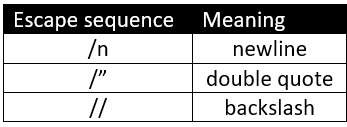
* These escape sequences can be used inside of print methods. Here are some examples:
```java
System.out.println("Jusan\nSingularity"); // prints Jusan
                                          //        Singularity

System.out.println("Monkey is \"the best\" animal"); // prints Monkey is "the best" animal

System.out.println("This is a \\backslash\\"); // prints This is a \backslash\
```

## Control structures
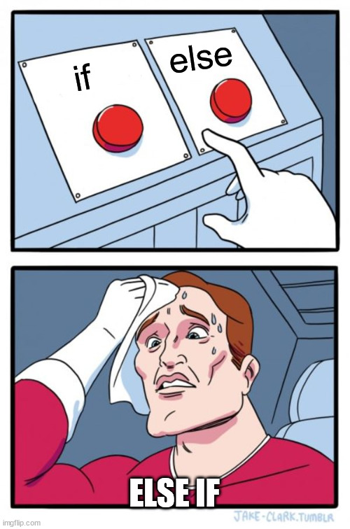
### Conditional statements
These include the if, if...else, and switch statements. They are all selection control structures that introduce a decision-making ability into a program. Based on the truth value of a boolean expression, the computer will decide which path to follow.

### The _if_ statement
In Java, an _if_ statement is a programming construct that allows the execution of a block of code based on a condition being true or false.

* The basic syntax of the if statement in Java is:
```java
if (condition) {
  statements // code to execute if condition is true
}
```
Here, "condition" is a Boolean expression that evaluates to either true or false. If the condition is true, the code block enclosed in curly braces is executed. If the condition is false, the code block is skipped, and program execution continues after the if statement.

* Here are some examples:

```java
int a = 10;

if (a % 2 == 0) { // if a is even number
  a--;            // then decrement it
}

if (a > 5) {  // if a is more than 5
  a /= 2;     // then divide it by 2
}

if (a == 4) {            // if a equals 4
  System.out.println(a); // then print it
}
```
### The if...else statement
You may need your program to execute another block of code only if condition is false. In such cases, you can use **else** statement with an **if** statement.

* The basic syntax of if...else statement:

```java
if (condition) {
  statements // code to execute if condition is true
}
else {
  statements // code to execute if condition is false
}
```
Here, if the condition is true, only the statements immediately following the test will be executed. If the condition is false, only the statements following the else will be executed.

* Here are some examples:
```java
int a = 12;

if (a < 10) { // if a is else than 10
  a += 10;    // add 10
}
else {
  a *= 2;     // otherwise, multiply it by 2
}

if (a == 12) {                                // if a equals 12
  System.out.println("value of a is 12");     // then print value of a is 12
}
else {
  System.out.println("value of a is not 12"); // otherwise, print value of a is not 12
}
```
### Nested if statement
If the statement part of an if statement is itself an if statement, the result is a nested if statement. This allows you to test for multiple conditions and execute different blocks of code depending on the outcome of those tests.

* The basic syntax of nested if statement:
```java
if (condition1) {
  if (condition2) {
    statements // code to execute if condition1 and condition2 is true
  }
}

// this is equivalent to

if (condition1 && condition2) {
  statements // code to execute if condition1 and condition2 is true
}
```
Here, the first if statement tests for condition1. If condition1 is true, then the code block inside the first set of curly braces is executed. Inside this block, there is another if statement that tests for condition2. If condition2 is true, then the code block inside the second set of curly braces is executed.

* Here are some examples:
```java
System.out.println("Enter your age");
int age = myScanner.nextInt(); // reads user input

if (age >= 0) {                                    // if age is more than or equal to 0
  if (age < 18) {                                  // if age is less than 18
    System.out.println("You cannot participate");  // prints You cannot participate
  }
  else {                                           // if age is more than 18
    System.out.println("You can participate");     // prints You can participate
  } 
}
else {                                             // if age is less than 0
  System.out.println("Incorrect input!");          // prints Incorrect input!
}
```
### Extended if statement
An extended if statement is a more complex form of the traditional if statement that allows you to specify multiple conditions and actions in a more concise and readable way.

* The basic syntax of extended if statement:
```java
if (condition1) {
    statements // code to execute if condition1 is true
}
else if (condition2) {
    statements // code to execute if condition2 is true
}
else if (condition3) {
    statements // code to execute if condition3 is true
}
else {
    statements // code to execute if all previous conditions are false
}
```
Here, 3 conditons are checked one by one and program enters a block of code of the first true condition. If all 3 conditions turn out to be false,  the final else statement is invoked.

* Here are some examples:
```java
char grade = myScanner.nextChar(); //reads user input
if (grade.equals('A'))
System.out.println("Excellent!");
else if (grade.equals('B'))
System.out.println("Good");
else if (grade.equals('C) || grade.equals('D'))
System.out.println("Poor");
else if (grade.equals('F'))
System.out.println("Egregious!");
else
System.out.println("Invalid grade");
```
If any of A, B, C, D, or F are entered, an appropriate message will be written, and control will go to the statement immediately following the extended if statement. If any other string is entered, the final else is invoked, and the message Invalid grade will be written.

### Switch statement


A switch statement is a programming construct that allows you to evaluate a variable or an expression against a list of possible values and execute different blocks of code based on the result of that evaluation.

* The basic syntax of a switch statement:
```java
switch (variable/expression) {
  case value1:
    statements  // code to execute if variable/expression is equal to value1
    break;
  case value2:
    statements  // code to execute if variable/expression is equal to value2
    break;
  default:
    statements  // code to execute if none of the cases match
}
```
In this syntax, `variable/expression` is the value that is evaluated, and `value1`, `value2`, etc. are the possible values that it could match. If `variable`/`expression` matches a value, the code block associated with that value is executed. If none of the values match, the code block inside the default statement is executed.

Note that each case statement is followed by a break statement. This is necessary to prevent the code from continuing to execute into the next case block. If there is no break statement, the code will continue to execute into the next case block until it encounters a break statement or the end of the switch statement.

* Here are some examples:
```java

int dayOfWeek = 4;
switch (dayOfWeek) {
case 1:
    System.out.println("Monday");
    break;
case 2:
    System.out.println("Tuesday");
    break;
case 3:
    System.out.println("Wednesday");
    break;
case 4:
    System.out.println("Thursday");
    break;
case 5:
    System.out.println("Friday");
    break;
case 6:
    System.out.println("Saturday");
    break;
case 7:
    System.out.println("Sunday");
    break; 
default:
    System.out.println("Wrong input");
}
```

In this example, the dayOfWeek variable is evaluated against the possible values 1-7. Since dayOfWeek is equal to 4, the code block associated with the case 4: statement is executed, which prints "Thursday" to the console.

* We can also group several cases into one if they have the same output:


```java
int dayOfWeek = 4;
switch (dayOfWeek) {
case 1, 2, 3, 4, 5:
    System.out.println("Weekdays");
    break;
case 6, 7:
    System.out.println("Weekend");
    break;
default:
    System.out.println("Wrong input");
}
```

In this example, all inputs from 1 to 5 print "Weekdays" while cases 6 and 7 print "Weekends". Since dayOfWeek is equal to 4, the code block associated with the case 4: statement is executed, which prints "Weekdays" to the console.

### Loops


#### For Loops


## Errors and exceptions


An exception is an error condition that occurs during the execution of a Java program

This material may be protected by copyright.

There are two types of exceptions:

1. Checked
2. Unchecked